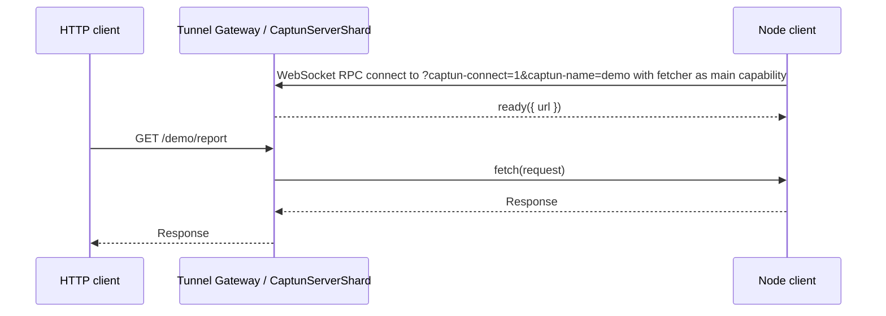

# Captun (cap[nweb] tun[nel])

Captun is a tiny reference implementation of a self-hosted ngrok or Cloudflare Tunnel alternative. It runs the public side on Cloudflare Workers and sends matching HTTP requests back to a Node process over [Cap'n Web](https://github.com/cloudflare/capnweb).

## Quick start

Expose a local HTTP server with the hosted `captun.sh` tunnel service:

```bash
npx captun 3000
```

That prints a public URL like `https://abc123.captun.sh` and forwards requests to `localhost:3000`.

If you want your own tunnel server, deploy a captun Worker to your Cloudflare account. You can think of this like your own personal ngrok server, but [faster](#performance):

`deploy` expects Cloudflare auth to already be available. Run `npx wrangler login` once, or set `CLOUDFLARE_API_TOKEN` for CI and other non-interactive shells.

```bash
npx captun deploy
```

<!-- # https://captun.my-account.workers.dev/funny-banana-wall

# [if you want tunnels like https://funny-banana-wall.tunnels.yourdomain.com instead - click here]


# mydomain.com and www.mydomain.com and something.mydomain.com
# then you _could_ say *.mydomain.com goes to tunnels - and that could include <tunnel-name>__tunnels.mydomain.com -->

The deploy command uses `wrangler` under the hood to deploy an opinionated captun Tunnel Gateway to your Cloudflare account, then stores its gateway URL and token in an XDG config file for later tunnel commands.

<!-- - With captun you can make your own faster ngrok for free in 10 seconds
  - This is how you use it on the cli
  - This is how you use it (your deployed ngrok) programmaticaly
- Or you can build other stuff like this very easily
  - Weather / vitest example
  - How we use it at iterate
  - Low level client API
  - Low level server API -->

### Programmatic usage

You can use the hosted service from code for receiving HTTP requests. First `npm install captun` to add it as a dependency. Then create it:

```ts
import { createCaptunTunnel } from "captun";

const tunnel = await createCaptunTunnel({
  fetch: async (request) => {
    const url = new URL(request.url);
    if (url.pathname.endsWith("/webhook")) {
      console.log("Received a webhook:", await request.json());
      return Response.json({ ok: true });
    }

    return new Response("not found", { status: 404 });
  },
});

console.log(`Listening to webhooks on ${tunnel.url}/webhook`);

await new Promise(() => {}); // stay alive until killed
```

That's all you need! No local ports, just a fetch function.

## Advanced usage

The captun [worker.ts](./src/worker.ts) implementation has useful opinions about "named tunnels", but you can also take full control of the server implementation (which is what we do in [iterate/iterate](https://github.com/iterate/iterate)). For example, here's a weather application which allows mocking its egress to the weather API:

```ts
import { DurableObject } from "cloudflare:workers";
import { acceptFetcherCapability, type FetcherStub } from "captun";

type WeatherReporterEnv = Env & {
  WEATHER_REPORTER_EGRESS: DurableObjectNamespace<WeatherReporterEgressTunnel>;
};

export class WeatherReporterEgressTunnel extends DurableObject<WeatherReporterEnv> {
  private egressFetcher: FetcherStub | undefined;

  async fetch(request: Request) {
    const url = new URL(request.url);

    if (url.pathname === "/weather") {
      // Here's the value our app provides: fetching and gorgeously formatting weather data
      const city = url.searchParams.get("city");
      const response = await this.egressFetch(`https://wttr.in/${city}?format=j1`);
      const weather = await response.json<{ current_condition: [{ temp_C: string }] }>();
      return new Response(
        `The temperature in ${city} is ${weather.current_condition[0].temp_C} celsius`,
      );
    }

    if (url.pathname === "/__intercept-egress-traffic") {
      // Here we set up our worker to allow clients/tests to intercept egress traffic
      this.egressFetcher?.[Symbol.dispose]();
      const { response, fetcher } = acceptFetcherCapability({
        onDisconnect: () => {
          if (this.egressFetcher === fetcher) this.egressFetcher = undefined;
        },
      });
      this.egressFetcher = fetcher;
      queueMicrotask(() => void fetcher.ready({ url: new URL(request.url).origin }));
      return response;
    }

    return new Response("Not found\n", { status: 404 });
  }

  get egressFetch(): typeof fetch {
    if (this.egressFetcher) {
      return async (input, init) => this.egressFetcher!.fetch(new Request(input, init));
    }
    return fetch;
  }
}

export default {
  fetch(request: Request, env: WeatherReporterEnv) {
    return env.WEATHER_REPORTER_EGRESS.getByName("default").fetch(request);
  },
} satisfies ExportedHandler<WeatherReporterEnv>;
```

The core client/server pieces (`createCaptunTunnel`, `acceptFetcherCapability`, `acceptFetcherCapabilityFromSocket`, `Fetcher`, and `FetcherStub`) live in [src/index.ts](./src/index.ts) — small TypeScript wrappers around [Cap'n Web](https://github.com/cloudflare/capnweb). For a deployable Cloudflare Tunnel Gateway, also copy or adapt [src/worker.ts](./src/worker.ts) and the Durable Object binding in [wrangler.jsonc](./wrangler.jsonc).

## Advanced CLI Usage

The CLI is mostly focused on ngrok-style use-cases. Without local config it uses the hosted `captun.sh` service. Once you have run `npx captun deploy`, further commands will pick up your self-hosted gateway URL and token from your machine's captun config. You can also pass them explicitly (for example, to create a tunnel using a deployment created from someone else's machine):

```bash
npx captun 3000 --gateway 'https://captun.youraccount.workers.dev' --token abc123
```

By default, the `npx captun 3000` command will generate a name for the tunnel it creates. You can customise this with `--name`:

```bash
npx captun 3000 --name my-very-serious-tunnel-name
```

By default the worker routes `/my-tunnel/foo/bar` to the capnweb session for "my-tunnel", and becomes a corresponding HTTP request with pathname `/foo/bar` when it reaches your client.

### Custom domains

Running `npx captun deploy` interactively walks you through where the tunnel URLs should live. There are four options, and which one is best for you depends on the kind of apps you want to tunnel to and whether you already have a domain on Cloudflare.

Routing is controlled by a single Worker env var, `CUSTOM_HOSTNAME`. When unset (workers.dev deploys), tunnels use folder routing: the first path segment is the tunnel name. When set (custom-domain deploys), tunnels use subdomain routing — the _last_ DNS label before `CUSTOM_HOSTNAME` is the tunnel name, and anything to the left of it is ignored. The deploy wizard sets `CUSTOM_HOSTNAME` for you; the parsing logic lives in `getTunnelNameFromUrl` in [src/routing.ts](./src/routing.ts).

#### 1. `<tunnel>.<account>.workers.dev/<tunnel-name>` (default)

Free, instant, no DNS setup. The tunnel URLs look like `https://captun.<account>.workers.dev/demo` and your app runs under the `/demo` path prefix.

**Pick this if:** you want the fastest possible setup, and the apps you're tunneling to are happy under a path prefix.

**Caveat:** apps that assume they live at `/` will misbehave — absolute redirects to `/login`, OAuth callbacks hardcoded to a root URL, cookies scoped to `Path=/`, and similar. If you hit any of those, pick one of the options below.

#### 2. `<tunnel>.your-domain.com` (free wildcard on an existing zone)

Free, instant. Tunnel URLs become `https://demo.your-domain.com/` — apps see a naked hostname, so path-prefix issues from option 1 disappear. Universal SSL covers first-level subdomains so no cert work is needed.

```bash
npx captun deploy --route '*.your-domain.com/*' --zone your-domain.com
```

**Pick this if:** you have a Cloudflare-managed domain you can dedicate to tunnels.

**Caveat:** the worker route `*.your-domain.com/*` will catch every otherwise-unrouted subdomain on this zone, which means you should only use this on a domain you've actually set aside for tunnels. Don't point it at your main production domain.

#### 3. `<tunnel>.captun.your-domain.com` (requires Advanced Certificate Manager)

Tunnels are namespaced under `captun.` on your existing domain (or whatever subdomain prefix you pick in the wizard), so the rest of the zone is unaffected.

```bash
npx captun deploy --route '*.captun.your-domain.com/*' --zone your-domain.com
```

[Universal SSL](https://developers.cloudflare.com/ssl/edge-certificates/universal-ssl/) only covers the apex and first-level subdomains, so `*.captun.your-domain.com` (a second-level wildcard) needs a separately-ordered certificate. The wizard handles this by ordering an [Advanced Certificate Manager](https://developers.cloudflare.com/ssl/edge-certificates/advanced-certificate-manager/) certificate pack for `*.captun.your-domain.com` + `captun.your-domain.com` and waiting for it to become active.

**Pick this if:** you want clean naming on an existing domain without the foot-gun of option 2.

**Caveat:** ACM is $10/month per zone. The wizard checks whether ACM is already enabled and bails with a link to the dashboard if it isn't — there's no way to subscribe to ACM via API.

#### 4. Dedicated tunnel domain

If you don't have a suitable Cloudflare-managed domain, registering a throwaway one (e.g. `my-tunnels.com`) and using it with option 2 ends up cheaper than enabling ACM for option 3 (~$9/year versus $10/month).

1. Register a domain via [Cloudflare Registrar](https://developers.cloudflare.com/registrar/) or any third-party registrar.
2. [Add the domain to your Cloudflare account](https://developers.cloudflare.com/dns/zone-setups/full-setup/) and wait for the zone to become active.
3. Re-run `captun deploy` and pick option 2 for the new zone.

### Sharding

By default, all tunnel names live in one warm `CaptunServerShard` Durable Object. That minimizes cold-start latency. Use `--shards` only when you need more aggregate throughput for many concurrent large responses:

```bash
npx captun deploy --shards 256
```

All of captun's public API (both the client `createCaptunTunnel` and the server-side `acceptFetcherCapability`) is exported from the single `captun` entry point. `acceptFetcherCapabilityFromSocket(socket)` is also exported for Workers that have already performed the WebSocket upgrade themselves.

## Performance

On May 18, 2026 from London, one warm-shard Captun tunnel reached first fetch in 188ms p50. Rechecking provider startup on the same day showed ngrok was much faster than the earlier sample: one ngrok ad-hoc tunnel reached 451ms, and 10 concurrent ngrok tunnels reached 658ms p50. Cloudflared quick tunnels still took about 8.5-9s when successful because the `trycloudflare.com` hostname was printed several seconds before DNS/public routing was ready.

| Ad-hoc tunnel            |     First fetch |
| ------------------------ | --------------: |
| captun                   |           188ms |
| ngrok                    |   451ms (+140%) |
| cloudflared quick tunnel | 8.51s (+4,427%) |

| 10 concurrent ad-hoc tunnels | Successful |             p50 |             p90 |             p99 |
| ---------------------------- | ---------: | --------------: | --------------: | --------------: |
| captun                       |      10/10 |           172ms |           186ms |           189ms |
| ngrok                        |      10/10 |   658ms (+283%) |   695ms (+274%) |   985ms (+421%) |
| cloudflared quick tunnel     |       2/10 | 8.89s (+5,069%) | 9.00s (+4,739%) | 9.00s (+4,662%) |

One shard is the default because it spins up fastest. More shards trade extra cold starts for more total throughput: 100 concurrent 2MiB streams through one shard took 26.34s p50, while 150 concurrent 2MiB streams spread over 256 warmed shards took 9.76s p50.


The scripts used for these numbers are [scripts/benchmark-startup.ts](./scripts/benchmark-startup.ts) and [scripts/benchmark-streams.ts](./scripts/benchmark-streams.ts); the compact recorded results are in [docs/performance](./docs/performance), with notes in [docs/benchmarks.md](./docs/benchmarks.md).

For test and development traffic, this should usually cost effectively nothing on Cloudflare: the [Workers Free plan](https://developers.cloudflare.com/workers/platform/pricing/) includes daily Worker requests, and Durable Objects have their own included free usage. Check pricing before serious volume, because connected Durable Objects cannot hibernate while the WebSocket is open.

## How Does It Work?

We just pass `fetch()` through `fetch()`. No, really.

With Cap'n Web, the Node client opens a WebSocket RPC session to the Worker and exposes its local fetcher as the session's main capability. The Worker's tunnel handle is a stub for that capability, whose only interesting method is `fetch(request)`. From then on, the Worker can forward public HTTP requests to that function and return the resulting `Response`.

All you need is `fetch()`. Requests, responses, headers, bodies, streams, SSE, and uploads are already web standards; this is the web-standards way this should work.



See [examples/weather-reporter](./examples/weather-reporter) for a small workspace package that imports `captun` and has its own e2e tests.

## Development

The Worker needs the `CaptunServerShard` Durable Object binding and migration from [wrangler.jsonc](./wrangler.jsonc). For local development:

```bash
pnpm install
pnpm run build
pnpm run dev
```

Run tests with `pnpm test`. The root e2e suite uses Miniflare by default; set `CAPTUN_GATEWAY`, with optional `CAPTUN_TOKEN`, to run the same cases against a deployed Worker.

End-to-end smoke tests for build, dry-run deploy, local `wrangler dev`, tunnel, and `curl` live in [`scripts/smoke/`](./scripts/smoke) with documentation in [docs/smoke-test.md](./docs/smoke-test.md):

```bash
pnpm smoke
./scripts/smoke-test.sh list
./scripts/smoke-test.sh step-5-tunnel-local
```

## Caveats

Captun is intentionally small. It is a reference implementation you can copy into a Worker or Durable Object, not a managed tunnel product.

It is fast but less durable than Cloudflare Tunnel. There is no redundant connection in another data center, and a connected Durable Object can still be restarted, so an in-flight request can fail.

Large binary streams are slower than small requests because a `Response` body crosses the Cap'n Web WebSocket/RPC session rather than getting spliced as a native HTTP socket. For webhook callbacks, mocked internet egress, local previews, and e2e tests, that tradeoff is usually fine.

Connecting a second client with the same tunnel name replaces the previous connection. Malformed percent-encoding in a folder tunnel name is rejected as a missing tunnel name.
