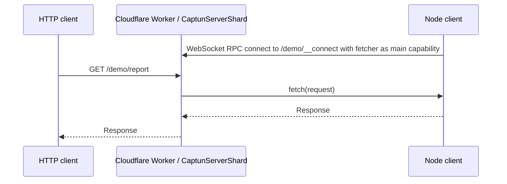

# Captun (cap[tainweb] tun[nel])

Captun is a tiny reference implementation of a self-hosted ngrok or Cloudflare Tunnel alternative. It runs the public side on Cloudflare Workers and sends matching HTTP requests back to a Node process over [Cap'n Web](https://github.com/cloudflare/capnweb).

```bash
# 1. Deploy your tunnel Worker (Cloudflare login or CLOUDFLARE_API_TOKEN required)
npx captun deploy

# 2. Tunnel a local port through it
python3 -m http.server 3000
npx captun 3000 --name demo

# 3. Hit your local server publicly
curl https://captun.<your-account>.workers.dev/demo/
```

`captun deploy` runs Wrangler, sets `CAPTUN_SECRET` on the Worker, and writes `~/.config/captun/config.json` (or `$XDG_CONFIG_HOME/captun/config.json`). Subsequent `captun <port>` calls read that config automatically.

Or use it directly from code:

```ts
import { createCaptunTunnel } from "captun/client";

using tunnel = await createCaptunTunnel({
  url: "https://captun.<your-account>.workers.dev/demo/__connect",
  fetch: (request) => fetch(request),
});
```

The core client/server pieces are small TypeScript modules around [Cap'n Web](https://github.com/cloudflare/capnweb): [src/client.ts](./src/client.ts), [src/server.ts](./src/server.ts), and [src/types.ts](./src/types.ts). For a deployable Cloudflare Worker, also copy or adapt [src/worker.ts](./src/worker.ts) and the Durable Object binding in [wrangler.toml](./wrangler.toml).

## 1. CLI Usage

### Deploy to `*.workers.dev`

```bash
npx captun deploy
```

Generates a random `CAPTUN_SECRET`, deploys the Worker, and saves `serverUrl` + `secret` to `~/.config/captun/config.json`. Pass `--secret <value>` to set your own.

### Deploy to a custom domain

```bash
npx captun deploy \
  --route '*.tunnels.example.com/*' \
  --zone example.com
```

`--zone` is required whenever Wrangler can't infer a zone from the route pattern (it usually can't). The Worker route is registered against that zone and tunnels resolve as `https://<name>.tunnels.example.com/`.

Cloudflare's [Universal SSL](https://developers.cloudflare.com/ssl/edge-certificates/universal-ssl/) covers the apex and first-level subdomains, so wildcards like `*.tunnels.example.com` work for free; deeper wildcards normally need [Advanced Certificate Manager](https://developers.cloudflare.com/ssl/edge-certificates/advanced-certificate-manager/).

### Tunnel a local port

```bash
python3 -m http.server 3000
npx captun 3000 --name demo
```

`captun <port>` reads `~/.config/captun/config.json`, so you only need flags to override:

```bash
npx captun 3000 --name demo \
  --server-url https://captun.<your-account>.workers.dev \
  --secret <captun-secret>
```

Environment overrides also work: `CAPTUN_SERVER_URL`, `CAPTUN_SECRET`. With no config and no overrides, `captun <port>` defaults to `http://localhost:8787` for local Worker development (`pnpm run dev`).

If you omit `--name`, the CLI generates a random hyphenated tunnel name.

### Routing

Folder tunnels are the golden path on `*.workers.dev`, `tunnels.*`, and apex hosts: the Worker routes `/:name/__connect` to the Cap'n Web session and `/:name/*` to normal proxied HTTP requests, stripping `/:name` before calling your local fetcher.

Subdomain tunnels (`*.tunnels.example.com/*`) feel cleaner if you have a domain to spare; buying a throwaway domain like `tunnels.example.com` for around $10/year is often the simplest option.

### Sharding

By default, all tunnel names live in one warm `CaptunServerShard` Durable Object. That minimizes cold-start latency. Set `CAPTUN_SHARDS` only when you need more aggregate throughput for many concurrent large responses:

```bash
pnpm exec wrangler deploy --var CAPTUN_SHARDS:256
```

## 2. Programmatic Usage

The client side is just a disposable connection:

```ts
import { createCaptunTunnel } from "captun/client";

using tunnel = await createCaptunTunnel({
  url: "https://captun.example.workers.dev/my-test/__connect",
  headers: process.env.CAPTUN_SECRET
    ? { authorization: `Bearer ${process.env.CAPTUN_SECRET}` }
    : undefined,
  fetch: async (request) => {
    const url = new URL(request.url);
    return fetch(`http://localhost:3000${url.pathname}${url.search}`, request);
  },
});
```

On the server side, authorize your connect route, accept it as a tunnel, then hand normal requests to `tunnel.fetch(request)`:

```ts
import { acceptCaptunTunnel, type CaptunServerTunnel } from "captun/server";

export class MyDurableObject {
  private tunnel?: CaptunServerTunnel;

  fetch(request: Request) {
    const url = new URL(request.url);
    if (url.pathname === "/egress/__connect") {
      const { response, tunnel } = acceptCaptunTunnel({
        onDisconnect: () => {
          if (this.tunnel === tunnel) this.tunnel = undefined;
        },
      });
      this.tunnel = tunnel;
      return response;
    }
    if (url.pathname.startsWith("/egress/")) {
      return (
        this.tunnel?.fetch(request) ?? new Response("No tunnel client connected", { status: 503 })
      );
    }
    return new Response("Not found", { status: 404 });
  }
}
```

You can import the public API from `captun`, or use subpath imports from `captun/client` and `captun/server`. The server package also exports `acceptCaptunTunnelFromSocket(socket)` for Workers that already performed the WebSocket upgrade.

### How Does It Work?

We just pass `fetch()` through `fetch()`. No, really.

With Cap'n Web, the Node client opens a WebSocket RPC session to the Worker and exposes its local fetcher as the session's main capability. The Worker's tunnel handle is a stub for that capability, whose only interesting method is `fetch(request)`. From then on, the Worker can forward public HTTP requests to that function and return the resulting `Response`.

All you need is `fetch()`. Requests, responses, headers, bodies, streams, SSE, and uploads are already web standards; this is the web-standards way this should work.



See [examples/weather-reporter](./examples/weather-reporter) for a small workspace package that imports `captun/server` and has its own `vite-plus` e2e tests.

## 3. Development

The Worker needs the `CaptunServerShard` Durable Object binding and migration from [wrangler.toml](./wrangler.toml). For local development:

```bash
pnpm install
pnpm run build
pnpm run dev
```

Run tests with `pnpm test`. The unit tests run without external services; the root e2e suite also runs when `CAPTUN_SERVER_URL` is set, with optional `CAPTUN_SECRET`.

End-to-end smoke tests (build, dry-run deploy, local `wrangler dev`, tunnel + curl) live in [`scripts/smoke/`](./scripts/smoke) with documentation in [docs/smoke-test.md](./docs/smoke-test.md):

```bash
pnpm smoke                                 # run the local suite
./scripts/smoke-test.sh list               # see all steps
./scripts/smoke-test.sh step-5-tunnel-local
```

## 4. Performance

On May 18, 2026 from London, one warm-shard Captun tunnel reached first fetch in 188ms p50. Rechecking provider startup on the same day showed ngrok was much faster than the earlier sample: one ngrok ad-hoc tunnel reached 451ms, and 10 concurrent ngrok tunnels reached 658ms p50. Cloudflared quick tunnels still took about 8.5-9s when successful because the `trycloudflare.com` hostname was printed several seconds before DNS/public routing was ready.

| Ad-hoc tunnel            | First fetch |
| ------------------------ | ----------: |
| Captun                   |       188ms |
| ngrok                    |       451ms |
| cloudflared quick tunnel |       8.51s |

| 10 concurrent ad-hoc tunnels | Successful |   p50 |   p90 |   p99 |
| ---------------------------- | ---------: | ----: | ----: | ----: |
| Captun                       |      10/10 | 172ms | 186ms | 189ms |
| ngrok                        |      10/10 | 658ms | 695ms | 985ms |
| cloudflared quick tunnel     |       2/10 | 8.89s | 9.00s | 9.00s |

One shard is the default because it spins up fastest. More shards trade extra cold starts for more total throughput: 100 concurrent 2MiB streams through one shard took 26.34s p50, while 150 concurrent 2MiB streams spread over 256 warmed shards took 9.76s p50.


The scripts used for these numbers are [scripts/benchmark-startup.ts](./scripts/benchmark-startup.ts) and [scripts/benchmark-streams.ts](./scripts/benchmark-streams.ts); the compact recorded results are in [docs/performance](./docs/performance), with notes in [docs/benchmarks.md](./docs/benchmarks.md).

For test and development traffic, this should usually cost effectively nothing on Cloudflare: the [Workers Free plan](https://developers.cloudflare.com/workers/platform/pricing/) includes daily Worker requests, and Durable Objects have their own included free usage. Check pricing before serious volume, because connected Durable Objects cannot hibernate while the WebSocket is open.

## 5. Caveats

Captun is intentionally small. It is a reference implementation you can copy into a Worker or Durable Object, not a managed tunnel product.

It is fast but less durable than Cloudflare Tunnel. There is no redundant connection in another data center, and a connected Durable Object can still be restarted, so an in-flight request can fail.

Large binary streams are slower than small requests because a `Response` body crosses the Cap'n Web WebSocket/RPC session rather than getting spliced as a native HTTP socket. For webhook callbacks, mocked internet egress, local previews, and e2e tests, that tradeoff is usually fine.

Connecting a second client with the same tunnel name replaces the previous connection. Malformed percent-encoding in a folder tunnel name is rejected as a missing tunnel name.
