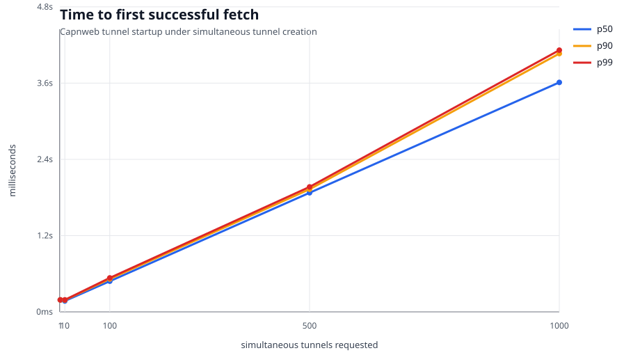
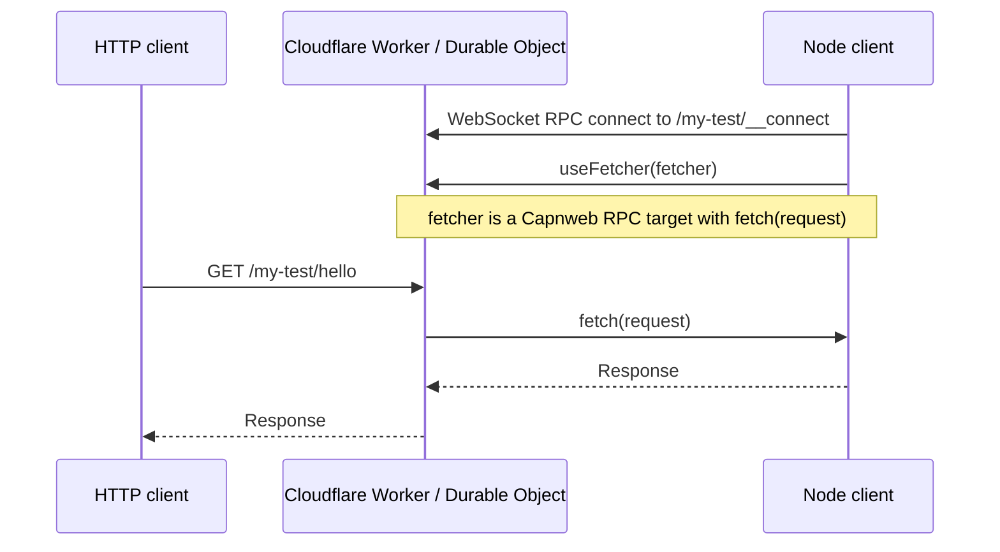

# capnweb-tunnel

`capnweb-tunnel` is a super fast and tiny reference implementation of a self-hosted ngrok or
Cloudflare Tunnel alternative. It runs the public server on Cloudflare Workers
and lets a local Node process provide the `fetch()` implementation that handles
incoming HTTP requests.

Deploy it:

```bash
pnpm install
pnpm run deploy
```

Expose a local server through a folder tunnel:

```bash
python3 -m http.server 3000

TUNNEL_SERVER_URL=https://capnweb-tunnel.<your-account>.workers.dev \
pnpm run cli -- --name my-test 3000
```

Then call it from any HTTP client:

```bash
curl https://capnweb-tunnel.<your-account>.workers.dev/my-test/
```

Or use the client directly:

```ts
import { CapnwebTunnelClient } from "./src/client";

using tunnel = await CapnwebTunnelClient.connect({
  serverUrl: "https://example.workers.dev/my-test",
  fetch: (request) => fetch(request),
});
```

The core client/server/types implementation is about 100 lines of code, built on
[Capnweb](https://github.com/cloudflare/capnweb). Ask your AI agent to copy it
into your project and adapt it.

For test and development traffic this should also be basically free: the
[Cloudflare Workers Free plan](https://developers.cloudflare.com/workers/platform/pricing/)
includes 100,000 Worker requests per day, and SQLite-backed Durable Objects are
available on the free plan with their own daily included request and duration
limits. Check the pricing page before running serious volume.

## Caveats

- The Durable Object cannot hibernate while tunnels are connected, so you are charged for wall-clock duration. See [Durable Objects pricing](https://developers.cloudflare.com/durable-objects/platform/pricing/).
- Unlike real Cloudflare Tunnel, there is no redundant connection in another data center; if the Durable Object is evicted during an HTTP request, that request can fail with a network error. See the [Durable Object lifecycle](https://developers.cloudflare.com/durable-objects/concepts/durable-object-lifecycle/).

We use it in end-to-end tests for deployed Cloudflare Workers: public internet
egress is sent back to the Vitest test runner, where responses are replayed from
a HAR archive. That lets us run real E2E tests against deployed Workers with a
fully mocked internet.

But you can use it for whatever you like. Use it instead of ngrok or Cloudflare
Tunnels when you want a small, fast tunnel that lives in your codebase.

## Performance

Startup is measured as time from starting tunnel creation to the first successful
HTTP fetch through that tunnel. On May 18, 2026 from London, a single Capnweb
tunnel on a warm shard reached first fetch in 188ms. The WebSocket + Capnweb
`useFetcher()` establishment itself is 56ms p50 once the shard Durable Object is
warm. A single ngrok ad-hoc tunnel reached first fetch in 1.62s. A cloudflared
quick tunnel reached first fetch in 8.96s after waiting for its
`trycloudflare.com` DNS record to exist.

| Ad-hoc tunnel | Result |
| --- | ---: |
| Capnweb | 188ms |
| ngrok | 1.62s |
| cloudflared quick tunnel | 8.96s |

The original one-DO-per-tunnel version was slow because every fresh tunnel paid
Cloudflare's new-Durable-Object startup cost. A tiny 1 KiB raw Worker+DO showed
the same shape, so this was not bundle size or Capnweb:

| Benchmark | p50 |
| --- | ---: |
| Edge Worker HTTP, no DO | 17ms |
| 1 KiB raw Worker -> fresh DO HTTP | 311ms |
| 1 KiB raw Worker -> fresh DO WebSocket | 378ms |
| Minimal Capnweb -> fresh DO `useFetcher()` | 410ms |
| Minimal Capnweb -> warm DO `useFetcher()` | 87ms |

The Worker now routes tunnel names onto shard Durable Objects. The default is
one shard for the lowest startup latency and simplest deployment. If you need
heavy parallel stream throughput, set `TUNNEL_SHARDS` to a higher value.

| Phase | Median |
| --- | ---: |
| WebSocket + Capnweb `useFetcher()` connect | 56ms |
| Server calls client `fetch()` | 59ms |
| Client fetches local origin | 2ms |
| First public HTTP fetch after connect | 86ms |
| Total startup to first fetch | 144ms |



| Simultaneous Capnweb tunnels | Successful | p50 | p90 | p99 |
| ---: | ---: | ---: | ---: | ---: |
| 1 | 1/1 | 188ms | 188ms | 188ms |
| 10 | 10/10 | 172ms | 186ms | 189ms |
| 100 | 100/100 | 483ms | 518ms | 534ms |
| 500 | 500/500 | 1.87s | 1.93s | 1.97s |
| 1000 | 1000/1000 | 3.61s | 4.07s | 4.12s |

Large binary streams are slower than small requests because a `Response` body
crosses the Capnweb session as WebSocket/RPC stream writes, not as a native HTTP
socket splice. Wrangler tail for a 2MiB stream showed the request served from
`LHR`, with the DO event taking 315ms wall / 21ms CPU and the WebSocket connect
event taking 622ms wall / 1ms CPU. That points at transport/backpressure and
serialization overhead, not CPU-bound Worker code.

The Node client is doing real work here, but it was not pinned. For one 2MiB
binary stream the client used about 149ms CPU over 530ms wall time, with event
loop utilization around 0.16. Reading the final public HTTP response with
`arrayBuffer()` was not faster than streaming it, so the slow part is not the
benchmark's response-body loop. Chunk size had a modest effect: 64KiB chunks
were fastest in the quick matrix, while very small chunks add RPC messages and
very large chunks still pay large JSON/WebSocket serialization costs.

| Payload through one tunnel | Mode | p50 |
| ---: | --- | ---: |
| 1KiB | bytes | 184ms |
| 64KiB | bytes | 354ms |
| 1MiB | bytes | 346ms |
| 2MiB | streamed bytes | 695ms |
| 2MiB | buffered bytes | 521ms |
| 2MiB | text | 411ms |
| 4MiB | streamed bytes | 900ms |

| 2MiB stream chunk size | Chunks | Total | Client CPU |
| ---: | ---: | ---: | ---: |
| 16KiB | 128 | 524ms | 146ms |
| 64KiB | 32 | 441ms | 125ms |
| 256KiB | 8 | 513ms | 125ms |
| 1MiB | 2 | 506ms | 118ms |
| 2MiB | 1 | 604ms | 121ms |

For many small responses, one shard is fine: 1000 concurrent 1KiB responses
completed 1000/1000 with p50 467ms and p99 580ms. For many large streams,
sharding helps because the bottleneck is per-DO stream throughput:

| Concurrent 2MiB streams | Shards | Successful | p50 | p90 | p99 |
| ---: | ---: | ---: | ---: | ---: | ---: |
| 100 | 1 | 100/100 | 26.34s | 26.72s | 26.78s |
| 150 | 10 | 150/150 | 29.10s | 33.54s | 37.83s |
| 150 | 256, warmed | 150/150 | 9.76s | 13.17s | 18.05s |
| 200 | 256, warmed | 200/200 | 6.93s | 20.26s | 25.27s |

This benchmark is intentionally measuring the "make a lot of tunnels ASAP"
shape. I did not try to force ngrok or cloudflared through thousands of parallel
ad-hoc tunnels; their ad-hoc products and account limits are not designed for
that shape. The raw benchmark data and scripts are in
[docs/performance](./docs/performance), [scripts/benchmark-startup.ts](./scripts/benchmark-startup.ts),
[scripts/benchmark-connect-phases.ts](./scripts/benchmark-connect-phases.ts),
[scripts/benchmark-capnweb-breakdown.ts](./scripts/benchmark-capnweb-breakdown.ts),
and [scripts/benchmark-large-streams.ts](./scripts/benchmark-large-streams.ts).
The client read-mode and chunk-size checks are recorded in
[docs/performance/client-read-stream-2mib.json](./docs/performance/client-read-stream-2mib.json),
[docs/performance/client-read-buffer-2mib.json](./docs/performance/client-read-buffer-2mib.json),
and [docs/performance/chunk-size-matrix-2mib.json](./docs/performance/chunk-size-matrix-2mib.json).
The cloudflared benchmark waits for DNS before its first HTTP probe; probing too
early can poison the local resolver with a negative lookup before the quick
tunnel hostname is published.

## How Does It Work?

We just pass `fetch()` through `fetch()`. No, really.

With Capnweb, a client can make a WebSocket connection to a server and pass the
server a fetch function. The server can then forward requests to it. That is the
whole tunnel: the Worker receives normal HTTP requests, calls the client-provided
`fetch(request)`, and returns the resulting `Response`.

All you need is `fetch()`. Requests, responses, headers, bodies, streams, SSE,
and uploads are already web standards. This is the web-standards way this should
work.



That is the key flow:

1. The client connects to the server.
2. The client runs in Node and the server runs in Cloudflare Workers.
3. The Capnweb session happens over WebSockets.
4. Once connected, the client can call RPC methods on the server.
5. The first call is `useFetcher(fetcher)`.
6. From then on, the server sends HTTP requests through `fetcher.fetch(request)`.

## Files

- [src/types.ts](./src/types.ts): the small shared Capnweb interface.
- [src/server.ts](./src/server.ts): `CapnwebTunnelServer` for Cloudflare Workers
  and Durable Objects.
- [src/client.ts](./src/client.ts): `CapnwebTunnelClient` for Node.
- [src/worker.ts](./src/worker.ts): example Worker routing named tunnels.

## Worker Routes

```text
/:name/*          -> HTTP requests for the named tunnel
/:name/__connect  -> Capnweb client connection for the named tunnel
```

The golden path is folder-based tunnels on the default Worker hostname:

```text
https://capnweb-tunnel.<your-account>.workers.dev/my-test
```

Deploy the Worker:

```bash
pnpm install
pnpm run deploy
```

Run the client:

```bash
TUNNEL_SERVER_URL=https://capnweb-tunnel.<your-account>.workers.dev \
pnpm run cli -- --name my-test 3000
```

The CLI keeps the tunnel open until you stop it with Ctrl+C.

Then send HTTP traffic to:

```text
https://capnweb-tunnel.<your-account>.workers.dev/my-test/anything
```

The Worker strips `/my-test` before calling the client fetcher, so the local
server sees `/anything`.

By default every tunnel name is stored inside one warm Durable Object. That is
the simplest and fastest setup for connection startup. If you need more
aggregate throughput for lots of concurrent large streams, set `TUNNEL_SHARDS`
to spread tunnel names across multiple Durable Objects:

```bash
pnpm exec wrangler deploy --var TUNNEL_SHARDS:256
```

## Connect Secret

By default, anyone who can reach `/:name/__connect` can attach a client for that
tunnel name. For real deployments, set a Worker secret:

```bash
pnpm exec wrangler secret put TUNNEL_SECRET
```

For local `wrangler dev`, put the same name in `.dev.vars`.

Then pass the same value to the client. The client appends it to the Cap'n Web
connect URL as `?secret=<secret>`:

```bash
TUNNEL_SECRET=<secret> pnpm run cli -- --name my-test 3000
# or:
pnpm run cli -- --name my-test --secret <secret> 3000
```

## Custom Hostnames

Some proxy targets behave better with naked hostnames than with path prefixes.
In that case, use the hostname to pick the tunnel:

```text
https://my-test.tunnels.example.com
```

Deploy with a wildcard Worker route:

```bash
pnpm exec wrangler deploy \
  --route "*.tunnels.example.com/*"
```

Option 1: use a subdomain of your existing domain, like
`*.tunnels.example.com`. This needs a proxied wildcard DNS record and an edge
certificate for the nested wildcard, usually via Cloudflare Advanced Certificate
Manager / Total TLS.

Option 2: buy a dedicated domain like `my-tunnels.com` for around $10/year and
use `*.my-tunnels.com`. That wildcard is only one level deep, so it fits
Cloudflare's normal Universal SSL setup and avoids the advanced certificate
work.

See Cloudflare's docs on
[Universal SSL](https://developers.cloudflare.com/ssl/edge-certificates/universal-ssl/),
[Universal SSL limitations](https://developers.cloudflare.com/ssl/edge-certificates/universal-ssl/limitations/),
and [Worker routes](https://developers.cloudflare.com/workers/configuration/routing/routes/)
for the underlying platform rules.

## Durable Object Integration

```ts
import { CapnwebTunnelServer } from "./server";

export class MyDurableObject implements DurableObject {
  private readonly tunnel = new CapnwebTunnelServer();

  fetch(request: Request): Promise<Response> {
    return this.tunnel.fetch(request);
  }
}
```

If your DO already has routes, handle those first and delegate the egress path:

```ts
async fetch(request: Request): Promise<Response> {
  const url = new URL(request.url);
  if (url.pathname === "/local") return new Response("handled locally");
  return this.tunnel.fetch(request);
}
```

## Node Client

```ts
import { CapnwebTunnelClient } from "./client";

using tunnel = await CapnwebTunnelClient.connect({
  serverUrl: "https://example.workers.dev/my-test",
  fetch: (request) => fetch(request),
});
```

The shared interface is deliberately tiny:

```ts
import type { RpcTarget } from "capnweb";

export type Fetcher = (request: Request) => Response | Promise<Response>;

export interface CapnwebTunnelClientCapability extends RpcTarget {
  fetch: Fetcher;
}

export interface CapnwebTunnelServerCapability extends RpcTarget {
  useFetcher(fetcher: CapnwebTunnelClientCapability): void | Promise<void>;
}
```

## CLI

```bash
TUNNEL_SERVER_URL=https://example.workers.dev pnpm run cli -- --name my-test 3000
```

## Test

```bash
pnpm install
pnpm run typecheck
pnpm run test:unit
```

In one terminal:

```bash
pnpm run dev
```

In another terminal:

```bash
TUNNEL_SERVER_URL=http://localhost:8787 pnpm test
```

Set `TUNNEL_SERVER_URL` to a deployed Worker URL to test against Cloudflare. For
wildcard subdomains, use `{name}` as a placeholder so each concurrent test gets
its own hostname:

```bash
TUNNEL_SERVER_URL=https://{name}.tunnels.example.com pnpm test
```
