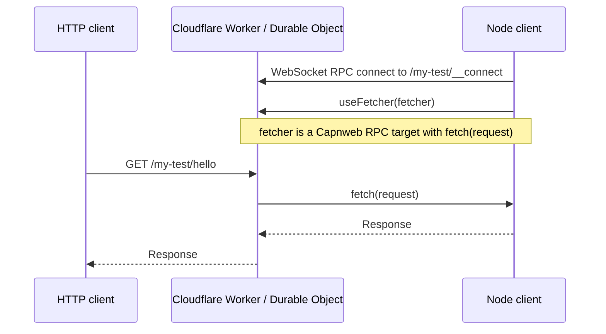

# capnweb-tunnel

`capnweb-tunnel` is a tiny reverse tunnel built on
[Capnweb](https://github.com/cloudflare/capnweb). It gives you a much faster
but slightly less durable alternative to Cloudflare Tunnels.

We use it in end-to-end tests for deployed Cloudflare Workers: public internet
egress is sent back to the Vitest test runner, where responses are replayed from
a HAR archive. That lets us run real E2E tests against deployed Workers with a
fully mocked internet.

But you can use it for whatever you like. Use it instead of ngrok or Cloudflare
Tunnels when you want a small, fast tunnel that lives in your codebase.

It is about 100 lines of code. Ask your AI agent to copy it into your project
and adapt it.

## Files

- [src/types.ts](./src/types.ts): the small shared Capnweb interface.
- [src/server.ts](./src/server.ts): `CapnwebTunnelServer` for Cloudflare Workers
  and Durable Objects.
- [src/client.ts](./src/client.ts): `CapnwebTunnelClient` for Node.
- [src/worker.ts](./src/worker.ts): example Worker routing named tunnels.

## How It Works

The whole tunnel is just one Capnweb RPC session over a WebSocket. The client
passes the server a capability with one method, `fetch(request)`, and the Worker
calls that capability whenever public HTTP traffic arrives.



That is the key flow:

1. The client connects to the server.
2. The client runs in Node and the server runs in Cloudflare Workers.
3. The Capnweb session happens over WebSockets.
4. Once connected, the client can call RPC methods on the server.
5. The first call is `useFetcher(fetcher)`.
6. From then on, the server sends HTTP requests through `fetcher.fetch(request)`.

## Worker Routes

```text
/:name/*          -> HTTP requests for the named tunnel
/:name/__connect  -> Capnweb client connection for the named tunnel
```

The golden path is folder-based tunnels on the default Worker hostname:

```text
https://capnweb-tunnel.<your-account>.workers.dev/my-test
```

Deploy the Worker:

```sh
npm install
npx wrangler deploy
```

Run the client:

```sh
TUNNEL_SERVER_URL=https://capnweb-tunnel.<your-account>.workers.dev \
npm run cli -- --name my-test 3000
```

Then send HTTP traffic to:

```text
https://capnweb-tunnel.<your-account>.workers.dev/my-test/anything
```

The Worker strips `/my-test` before calling the client fetcher, so the local
server sees `/anything`.

## Custom Hostnames

You can put the Worker on your own hostname and keep the same folder-based
tunnel URLs:

```sh
npx wrangler deploy --route tunnels.example.com/*
```

Then use `https://tunnels.example.com/my-test`.

You can also use wildcard subdomains for named tunnels:

```text
https://my-test.tunnels.example.com
```

deploy with a wildcard Worker route:

```sh
npx wrangler deploy \
  --route tunnels.example.com/* \
  --route "*.tunnels.example.com/*"
```

With that route, the Worker takes the tunnel name from the hostname instead of
the first path segment. The same tunnel can then be reached as
`https://my-test.tunnels.example.com/anything`, and the client can connect to
`https://my-test.tunnels.example.com`.

```sh
TUNNEL_SERVER_URL=https://my-test.tunnels.example.com npm run cli -- 3000
```

You also need a proxied wildcard DNS record for `*.tunnels.example.com` and a
Cloudflare edge certificate covering `*.tunnels.example.com`.
Universal SSL on a normal full-zone setup covers `example.com` and
`*.example.com`; it does not cover nested wildcards like
`*.tunnels.example.com`. Use Advanced Certificate Manager / Total TLS, or order
an advanced certificate for `*.tunnels.example.com`.

If you do not want Advanced Certificate Manager, use `https://tunnels.example.com`
instead of `https://name.tunnels.example.com`, or route directly from
`*.example.com/*` if you are happy to reserve the whole first-level wildcard for
tunnels.

Cloudflare docs:

- Universal SSL: https://developers.cloudflare.com/ssl/edge-certificates/universal-ssl/
- Universal SSL limitations: https://developers.cloudflare.com/ssl/edge-certificates/universal-ssl/limitations/
- Worker routes: https://developers.cloudflare.com/workers/configuration/routing/routes/

## Durable Object Integration

```ts
import { CapnwebTunnelServer } from "./server";

export class MyDurableObject implements DurableObject {
  private readonly tunnel = new CapnwebTunnelServer();

  fetch(request: Request): Promise<Response> {
    return this.tunnel.fetch(request);
  }
}
```

If your DO already has routes, handle those first and delegate the egress path:

```ts
async fetch(request: Request): Promise<Response> {
  const url = new URL(request.url);
  if (url.pathname === "/local") return new Response("handled locally");
  return this.tunnel.fetch(request);
}
```

## Node Client

```ts
import { CapnwebTunnelClient } from "./client";

const client = new CapnwebTunnelClient("https://example.workers.dev/my-test", {
  fetch: (request) => fetch(request),
});

await client.connect();
```

The shared interface is deliberately tiny:

```ts
import type { RpcTarget } from "capnweb";

export interface CapnwebTunnelFetcher extends RpcTarget {
  fetch(request: Request): Response | Promise<Response>;
}

export interface CapnwebTunnelServerApi extends RpcTarget {
  useFetcher(fetcher: CapnwebTunnelFetcher): string | Promise<string>;
}
```

## CLI

```sh
TUNNEL_SERVER_URL=https://example.workers.dev npm run cli -- --name my-test 3000
```

## Test

```sh
npm install
npm run typecheck
```

In one terminal:

```sh
npm run dev
```

In another terminal:

```sh
npm test
```

`TUNNEL_SERVER_URL` defaults to `http://localhost:8787`. Set it to a deployed
Worker URL to test against Cloudflare.
