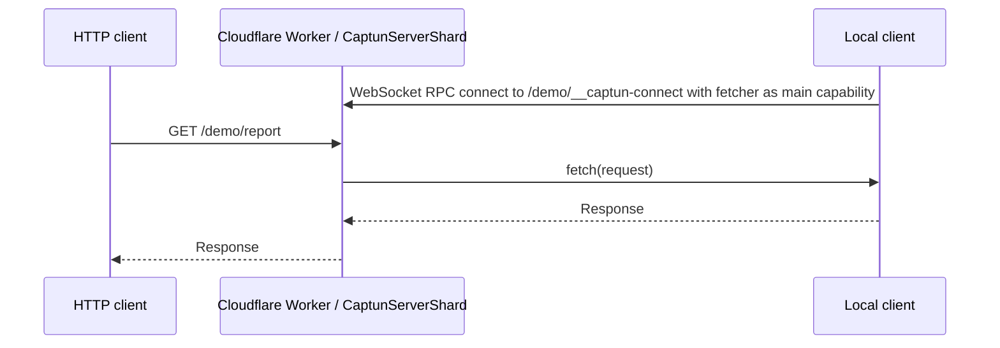

# Captun (cap[tainweb] tun[nel])

Captun is a tiny reference implementation of a self-hosted ngrok or Cloudflare Tunnel alternative. It runs the public side on Cloudflare Workers and sends matching HTTP requests back to a local fetch function over [Cap'n Web](https://github.com/cloudflare/capnweb).

## Quick start

First deploy a captun worker to your cloudflare account. You can think of this like your own personal ngrok server, but [faster](#performance):

```bash
npx captun deploy
```

Then tunnel to it:

```bash
npx captun 3000
```

<!-- # https://captun.my-account.workers.dev/funny-banana-wall 

# [if you want tunnels like https://funny-banana-wall.tunnels.yourdomain.com instead - click here]


# mydomain.com and www.mydomain.com and something.mydomain.com 
# then you _could_ say *.mydomain.com goes to tunnels - and that could include <tunnel-name>__tunnels.mydomain.com -->

The deploy command will use `wrangler` under the hood to deploy an opinionated captun-tunneler-worker to your cloudflare account, and will store the server url in an XDG config file, and uses it when you tunnel to it.

<!-- - With captun you can make your own faster ngrok for free in 10 seconds
  - This is how you use it on the cli
  - This is how you use it (your deployed ngrok) programmaticaly
- Or you can build other stuff like this very easily
  - Weather / vitest example
  - How we use it at iterate
  - Low level client API
  - Low level server API -->

### Programmatic usage

You can use the worker you just deployed to create a tunnel from code for receiving HTTP requests. First `npm install captun` to add it as a dependency. Then create it:

```ts
import { createCaptunTunnel } from "captun/client";

const url = "https://captun.account.workers.dev/my-cool-tunnel"

const tunnel = await createCaptunTunnel({
  url: `${url}/__captun-connect`, // creates a tunnel named "my-tunnel". choose any slug-safe string here
  fetch: async (request) => {
    const url = new URL(request.url)
    if (url.pathname.endsWith('/webhook')) {
      console.log('Received a webhook:', await request.json())
      return Response.json({ ok: true })
    }

    return new Response('not found', { status: 404 })
  },
});

console.log(`Listening to webhooks on ${url}/webhook`)

await new Promise(() => {}) // stay alive until killed
```

That's all you need! No local ports, just a fetch function.

## Advanced usage

The captun [worker.ts](./src/worker.ts) implementation has useful opinions about "named tunnels", but you can also take full control of the server implementation (which is what we do in [iterate/iterate](https://github.com/iterate/iterate)). For example, here's a weather application which allows mocking its egress to the weather API:

```ts
import { DurableObject } from "cloudflare:workers";
import { acceptCaptunTunnel, type CaptunServerTunnel } from "captun/server";

type WeatherReporterEnv = Env & {
  WEATHER_REPORTER_EGRESS: DurableObjectNamespace<WeatherReporterEgressTunnel>;
};

export class WeatherReporterEgressTunnel extends DurableObject<WeatherReporterEnv> {
  private egressTunnel: CaptunServerTunnel | undefined;
  private readonly egressFetch: typeof fetch = async (input, init) => {
    if (this.egressTunnel) return this.egressTunnel.fetch(new Request(input, init));
    return fetch(input, init);
  };

  async fetch(request: Request) {
    const url = new URL(request.url);

    if (url.pathname === "/weather") {
      // Here's the value our app provides: fetching and gorgeously formatting weather data
      const city = url.searchParams.get("city") || "";
      const response = await this.egressFetch(`https://wttr.in/${city}?format=j1`);
      const weather = (await response.json()) as {
        current_condition: [{ temp_C: string }];
      };
      return new Response(`The temperature in ${city} is ${weather.current_condition[0].temp_C} celsius`);
    }

    if (url.pathname === "/__intercept-egress-traffic") {
      // Here we set up our worker to allow clients/tests to intercept egress traffic
      const { response, tunnel } = acceptCaptunTunnel({
        onDisconnect: () => {
          if (this.egressTunnel === tunnel) this.egressTunnel = undefined;
        },
      });
      this.egressTunnel?.[Symbol.dispose]();
      this.egressTunnel = tunnel;
      return response;
    }

    return new Response("Not found\n", { status: 404 });
  }
}

export default {
  fetch(request: Request, env: WeatherReporterEnv) {
    return env.WEATHER_REPORTER_EGRESS.getByName("default").fetch(request);
  },
} satisfies ExportedHandler<WeatherReporterEnv>;
```

The core client/server pieces are small TypeScript modules around [Cap'n Web](https://github.com/cloudflare/capnweb): [src/client.ts](./src/client.ts), [src/server.ts](./src/server.ts), and [src/types.ts](./src/types.ts). `captun/server` contains the Cloudflare `WebSocketPair` helper and the standard `acceptCaptunTunnelFromSocket(socket)` core. Runtime-specific subpaths adapt that core to the server upgrade shape:

- `captun/bun`: `createCaptunBunTunnelHandler()` for `Bun.serve({ fetch, websocket })`.
- `captun/deno`: `acceptCaptunDenoTunnel(socket)` for `Deno.upgradeWebSocket(request)`.
- `captun/node`: `acceptCaptunNodeTunnel(socket)` for `ws`/Node HTTP upgrade handlers.

For a deployable Cloudflare Worker, also copy or adapt [src/worker.ts](./src/worker.ts) and the Durable Object binding in [wrangler.toml](./wrangler.toml).

## Advanced CLI Usage

The CLI is mostly focused on ngrok-style use-cases with our opinionated worker deployment. Once you have run `npx captun deploy`, further commands will pick up the server URL and connection secret from your machine's captun config. You can also pass them explicitly (for example, to create a tunnel using a deployment created from someone else's machine):

```bash
npx captun 3000 --server-url 'https://abc123.captun.youraccount.workers.dev' --secret abc123
```

By default, the `npx captun 3000` command will generate a name for the tunnel it creates. You can customise this with `--name`:

```bash
npx captun 3000 --name my-very-serious-tunnel-name
```

By default the worker routes `/my-tunnel/foo/bar` to the capnweb session for "my-tunnel", and becomes a corresponding HTTP request with pathname `/foo/bar` when it reaches your client.

### Custom hostnames

Some proxy targets behave better with a naked hostname than with a path prefix. In that case, route `*.my-tunnels.com/*` to the Worker and call `https://demo.my-tunnels.com/`; buying a throwaway domain like `my-tunnels.com`. The built-in router uses folder routing on `workers.dev`, `tunnels.*`, and apex-style hosts, and subdomain routing for wildcard hosts like `demo.my-tunnels.com`.

```bash
npx captun deploy --route '*.tunnels.example.com/*' --zone example.com
```

If you prefer `*.tunnels.example.com/*`, Cloudflare's [Universal SSL](https://developers.cloudflare.com/ssl/edge-certificates/universal-ssl/) covers the apex and first-level subdomains, so deeper wildcard hostnames normally need [Advanced Certificate Manager](https://developers.cloudflare.com/ssl/edge-certificates/advanced-certificate-manager/) or another certificate option.

### Sharding

By default, all tunnel names live in one warm `CaptunServerShard` Durable Object. That minimizes cold-start latency. Use `--shards` only when you need more aggregate throughput for many concurrent large responses:

```bash
npx captun deploy --shards 256
```

You can import the public API from `captun`, or use subpath imports from `captun/client`, `captun/server`, `captun/bun`, `captun/deno`, and `captun/node`.

## Performance

On May 18, 2026 from London, one warm-shard Captun tunnel reached first fetch in 188ms p50. Rechecking provider startup on the same day showed ngrok was much faster than the earlier sample: one ngrok ad-hoc tunnel reached 451ms, and 10 concurrent ngrok tunnels reached 658ms p50. Cloudflared quick tunnels still took about 8.5-9s when successful because the `trycloudflare.com` hostname was printed several seconds before DNS/public routing was ready.

| Ad-hoc tunnel            | First fetch |
| ------------------------ | ----------: |
| captun                   |       188ms |
| ngrok                    | 451ms (+140%) |
| cloudflared quick tunnel | 8.51s (+4,427%) |

| 10 concurrent ad-hoc tunnels | Successful |   p50 |   p90 |   p99 |
| ---------------------------- | ---------: | ----: | ----: | ----: |
| captun                       |      10/10 | 172ms | 186ms | 189ms |
| ngrok                        |      10/10 | 658ms (+283%) | 695ms (+274%) | 985ms (+421%) |
| cloudflared quick tunnel     |       2/10 | 8.89s (+5,069%) | 9.00s (+4,739%) | 9.00s (+4,662%) |

One shard is the default because it spins up fastest. More shards trade extra cold starts for more total throughput: 100 concurrent 2MiB streams through one shard took 26.34s p50, while 150 concurrent 2MiB streams spread over 256 warmed shards took 9.76s p50.


The scripts used for these numbers are [scripts/benchmark-startup.ts](./scripts/benchmark-startup.ts) and [scripts/benchmark-streams.ts](./scripts/benchmark-streams.ts); the compact recorded results are in [docs/performance](./docs/performance), with notes in [docs/benchmarks.md](./docs/benchmarks.md).

For test and development traffic, this should usually cost effectively nothing on Cloudflare: the [Workers Free plan](https://developers.cloudflare.com/workers/platform/pricing/) includes daily Worker requests, and Durable Objects have their own included free usage. Check pricing before serious volume, because connected Durable Objects cannot hibernate while the WebSocket is open.

## How Does It Work?

We just pass `fetch()` through `fetch()`. No, really.

With Cap'n Web, the Node client opens a WebSocket RPC session to the Worker and exposes its local fetcher as the session's main capability. The Worker's tunnel handle is a stub for that capability, whose only interesting method is `fetch(request)`. From then on, the Worker can forward public HTTP requests to that function and return the resulting `Response`.

All you need is `fetch()`. Requests, responses, headers, bodies, streams, SSE, and uploads are already web standards; this is the web-standards way this should work.



See [examples/bun](./examples/bun), [examples/node](./examples/node), [examples/deno](./examples/deno), and [examples/cloudflare](./examples/cloudflare) for small self-contained weather apps that run the same egress-intercepting flow from Vitest.

## Development

The Worker needs the `CaptunServerShard` Durable Object binding and migration from [wrangler.toml](./wrangler.toml). For local development:

```bash
pnpm install
pnpm run build
pnpm run dev
```

Run tests with `pnpm test`. The root e2e suite uses Miniflare by default; set `CAPTUN_SERVER_URL`, with optional `CAPTUN_SECRET`, to run the same cases against a deployed Worker.

End-to-end smoke tests for build, dry-run deploy, local `wrangler dev`, tunnel, and `curl` live in [`scripts/smoke/`](./scripts/smoke) with documentation in [docs/smoke-test.md](./docs/smoke-test.md):

```bash
pnpm smoke
./scripts/smoke-test.sh list
./scripts/smoke-test.sh step-5-tunnel-local
```

## Caveats

Captun is intentionally small. It is a reference implementation you can copy into a Worker or Durable Object, not a managed tunnel product.

It is fast but less durable than Cloudflare Tunnel. There is no redundant connection in another data center, and a connected Durable Object can still be restarted, so an in-flight request can fail.

Large binary streams are slower than small requests because a `Response` body crosses the Cap'n Web WebSocket/RPC session rather than getting spliced as a native HTTP socket. For webhook callbacks, mocked internet egress, local previews, and e2e tests, that tradeoff is usually fine.

Connecting a second client with the same tunnel name replaces the previous connection. Malformed percent-encoding in a folder tunnel name is rejected as a missing tunnel name.
