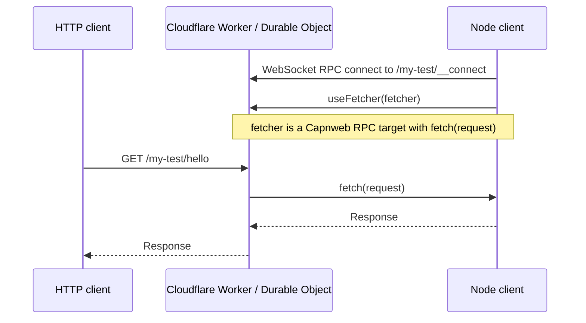

# capnweb-tunnel

`capnweb-tunnel` is a super fast and tiny reference implementation of a self-hosted ngrok or
Cloudflare Tunnel alternative. It runs the public server on Cloudflare Workers
and lets a local Node process provide the `fetch()` implementation that handles
incoming HTTP requests.

Deploy it:

```bash
npm install
npx wrangler deploy
```

Expose a local server through a folder tunnel:

```bash
python3 -m http.server 3000

TUNNEL_SERVER_URL=https://capnweb-tunnel.<your-account>.workers.dev \
npm run cli -- --name my-test 3000
```

Then call it from any HTTP client:

```bash
curl https://capnweb-tunnel.<your-account>.workers.dev/my-test/
```

Or use the client directly:

```ts
import { CapnwebTunnelClient } from "./src/client";

const client = new CapnwebTunnelClient("https://example.workers.dev/my-test", {
  fetch: (request) => fetch(request),
});

await client.connect();
```

The core client/server/types implementation is about 100 lines of code, built on
[Capnweb](https://github.com/cloudflare/capnweb). Ask your AI agent to copy it
into your project and adapt it.

For test and development traffic this should also be basically free: the
[Cloudflare Workers Free plan](https://developers.cloudflare.com/workers/platform/pricing/)
includes 100,000 Worker requests per day, and SQLite-backed Durable Objects are
available on the free plan with their own daily included request and duration
limits. Check the pricing page before running serious volume.

We use it in end-to-end tests for deployed Cloudflare Workers: public internet
egress is sent back to the Vitest test runner, where responses are replayed from
a HAR archive. That lets us run real E2E tests against deployed Workers with a
fully mocked internet.

But you can use it for whatever you like. Use it instead of ngrok or Cloudflare
Tunnels when you want a small, fast tunnel that lives in your codebase.

## Performance

Startup is measured as time from starting tunnel creation to the first successful
HTTP fetch through that tunnel. On May 18, 2026 from London, a single Capnweb
tunnel reached first fetch in 527ms. A single ngrok ad-hoc tunnel reached first
fetch in 1.62s. A cloudflared quick tunnel reached first fetch in 8.96s after
waiting for its `trycloudflare.com` DNS record to exist.

| Ad-hoc tunnel | Result |
| --- | ---: |
| Capnweb | 527ms |
| ngrok | 1.62s |
| cloudflared quick tunnel | 8.96s |

For Capnweb, the single-tunnel median breaks down like this:

| Phase | Median |
| --- | ---: |
| WebSocket + Capnweb `useFetcher()` connect | 412ms |
| Server calls client `fetch()` | 64ms |
| Client fetches local origin | 2ms |
| First public HTTP fetch after connect | 91ms |
| Total startup to first fetch | 503ms |


| Simultaneous Capnweb tunnels | Successful | p50 | p90 | p99 |
| ---: | ---: | ---: | ---: | ---: |
| 1 | 1/1 | 527ms | 527ms | 527ms |
| 10 | 10/10 | 541ms | 585ms | 628ms |
| 100 | 100/100 | 1.18s | 1.42s | 1.54s |
| 500 | 500/500 | 9.43s | 9.52s | 9.53s |
| 1000 | 764/1000 | 15.50s | 15.64s | 15.66s |
| 2000 | 856/2000 | 41.08s | 41.21s | 41.39s |

This benchmark is intentionally measuring the "make a lot of tunnels ASAP"
shape. I did not try to force ngrok or cloudflared through thousands of parallel
ad-hoc tunnels; their ad-hoc products and account limits are not designed for
that shape. The honest story is: individual Capnweb tunnels are fast, hundreds
of them can be created in parallel, and this deployment starts saturating
between 500 and 1000 simultaneous tunnel creations. The raw benchmark data and
scripts are in [docs/performance](./docs/performance) and
[scripts/benchmark-startup.ts](./scripts/benchmark-startup.ts). The cloudflared
benchmark waits for DNS before its first HTTP probe; probing too early can poison
the local resolver with a negative lookup before the quick tunnel hostname is
published.

## How Does It Work?

We just pass `fetch()` through `fetch()`. No, really.

With Capnweb, a client can make a WebSocket connection to a server and pass the
server a fetch function. The server can then forward requests to it. That is the
whole tunnel: the Worker receives normal HTTP requests, calls the client-provided
`fetch(request)`, and returns the resulting `Response`.

All you need is `fetch()`. Requests, responses, headers, bodies, streams, SSE,
and uploads are already web standards. This is the web-standards way this should
work.



That is the key flow:

1. The client connects to the server.
2. The client runs in Node and the server runs in Cloudflare Workers.
3. The Capnweb session happens over WebSockets.
4. Once connected, the client can call RPC methods on the server.
5. The first call is `useFetcher(fetcher)`.
6. From then on, the server sends HTTP requests through `fetcher.fetch(request)`.

## Files

- [src/types.ts](./src/types.ts): the small shared Capnweb interface.
- [src/server.ts](./src/server.ts): `CapnwebTunnelServer` for Cloudflare Workers
  and Durable Objects.
- [src/client.ts](./src/client.ts): `CapnwebTunnelClient` for Node.
- [src/worker.ts](./src/worker.ts): example Worker routing named tunnels.

## Worker Routes

```text
/:name/*          -> HTTP requests for the named tunnel
/:name/__connect  -> Capnweb client connection for the named tunnel
```

The golden path is folder-based tunnels on the default Worker hostname:

```text
https://capnweb-tunnel.<your-account>.workers.dev/my-test
```

Deploy the Worker:

```bash
npm install
npx wrangler deploy
```

Run the client:

```bash
TUNNEL_SERVER_URL=https://capnweb-tunnel.<your-account>.workers.dev \
npm run cli -- --name my-test 3000
```

The CLI keeps the tunnel open until you stop it with Ctrl+C.

Then send HTTP traffic to:

```text
https://capnweb-tunnel.<your-account>.workers.dev/my-test/anything
```

The Worker strips `/my-test` before calling the client fetcher, so the local
server sees `/anything`.

## Connect Secret

By default, anyone who can reach `/:name/__connect` can attach a client for that
tunnel name. For real deployments, set a Worker secret:

```bash
npx wrangler secret put TUNNEL_SECRET
```

For local `wrangler dev`, put the same name in `.dev.vars`.

Then pass the same value to the client. The client appends it to the Cap'n Web
connect URL as `?secret=<secret>`:

```bash
TUNNEL_SECRET=<secret> npm run cli -- --name my-test 3000
# or:
npm run cli -- --name my-test --secret <secret> 3000
```

## Custom Hostnames

Some proxy targets behave better with naked hostnames than with path prefixes.
In that case, use the hostname to pick the tunnel:

```text
https://my-test.tunnels.example.com
```

Deploy with a wildcard Worker route:

```bash
npx wrangler deploy \
  --route "*.tunnels.example.com/*"
```

Option 1: use a subdomain of your existing domain, like
`*.tunnels.example.com`. This needs a proxied wildcard DNS record and an edge
certificate for the nested wildcard, usually via Cloudflare Advanced Certificate
Manager / Total TLS.

Option 2: buy a dedicated domain like `my-tunnels.com` for around $10/year and
use `*.my-tunnels.com`. That wildcard is only one level deep, so it fits
Cloudflare's normal Universal SSL setup and avoids the advanced certificate
work.

See Cloudflare's docs on
[Universal SSL](https://developers.cloudflare.com/ssl/edge-certificates/universal-ssl/),
[Universal SSL limitations](https://developers.cloudflare.com/ssl/edge-certificates/universal-ssl/limitations/),
and [Worker routes](https://developers.cloudflare.com/workers/configuration/routing/routes/)
for the underlying platform rules.

## Durable Object Integration

```ts
import { CapnwebTunnelServer } from "./server";

export class MyDurableObject implements DurableObject {
  private readonly tunnel = new CapnwebTunnelServer();

  fetch(request: Request): Promise<Response> {
    return this.tunnel.fetch(request);
  }
}
```

If your DO already has routes, handle those first and delegate the egress path:

```ts
async fetch(request: Request): Promise<Response> {
  const url = new URL(request.url);
  if (url.pathname === "/local") return new Response("handled locally");
  return this.tunnel.fetch(request);
}
```

## Node Client

```ts
import { CapnwebTunnelClient } from "./client";

const client = new CapnwebTunnelClient("https://example.workers.dev/my-test", {
  fetch: (request) => fetch(request),
});

await client.connect();
```

The shared interface is deliberately tiny:

```ts
import type { RpcTarget } from "capnweb";

export type Fetcher = (request: Request) => Response | Promise<Response>;

export interface CapnwebTunnelClientCapability extends RpcTarget {
  fetch: Fetcher;
}

export interface CapnwebTunnelServerCapability extends RpcTarget {
  useFetcher(fetcher: CapnwebTunnelClientCapability): void | Promise<void>;
}
```

## CLI

```bash
TUNNEL_SERVER_URL=https://example.workers.dev npm run cli -- --name my-test 3000
```

## Test

```bash
npm install
npm run typecheck
npm run test:unit
```

In one terminal:

```bash
npm run dev
```

In another terminal:

```bash
TUNNEL_SERVER_URL=http://localhost:8787 npm test
```

Set `TUNNEL_SERVER_URL` to a deployed Worker URL to test against Cloudflare. For
wildcard subdomains, use `{name}` as a placeholder so each concurrent test gets
its own hostname:

```bash
TUNNEL_SERVER_URL=https://{name}.tunnels.example.com npm test
```
